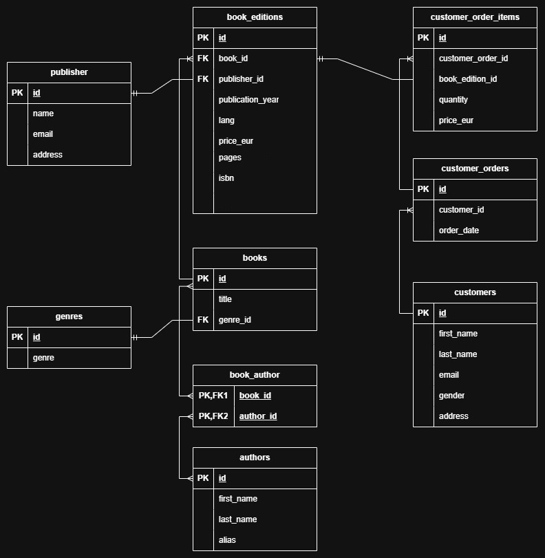

# BookStore Database
BookStore database models a simple business scenario for a small, online bookstore.

## Project Scope

This project focuses on backend data validation for a relational bookstore database.
The goal is to identify data integrity issues, business logic violations, and relational inconsistencies using SQL queries.

## Requirements
Before cloning the repository, make sure that the necessary tools are installed.

|Tool|Version|
|--|--|
|PostgreSQL|18.2|
|Python|3.14.3|

Python packages:
* psycopg2

## How to run?
1. Clone the repository `https://github.com/FrancoCaredda/BookStoreDB.git`  
2. Open the cloned folder in a terminal  
3. Run `python build.py <username> <password>` 
4. Run `python import_all_tables.py <username> <password>`
5. Once you see the success message in the terminal, the db is ready

## Test cases

|ID|Description|Precondition|Steps|Expected Results|Severity|
|--|--|--|--|--|--|
|BK-001|Verify that the prices of books are not negative|Active connection to the database + imported data|1. Filter records in book edition for price being less than zero; 2. Observe the results|No rows are returned|High|
|BK-002|Verify that books have at least one author associated with them|Active connection to the database + imported data|1. Filter records in books for absence in the book_author conjunction table; 2. Observe the result|No rows are returned|Critical|
|BK-003|Verify that orders have at least one order item associated with them|Active connection to the database + imported data|1. Filter records in customer_orders for absence in customer_order_items; 2. Observe the results|No rows are returned|Critical|
|BK-004|Verify that there are no orders with items that are out of stock|Active connection to the database + imported data|1. Find all book editions that have stock_amount = 0; 2. Find the order items that point to these editions; 3. Observe the results|No rows are returned|Critical|
|BK-005|Verify that there are no order items with the quantity greater than the stock amount|Active connection to the database + imported data|1. Join customer_order_items with book_editions; 2. Filter records for quantity > stock_amount; 3. Observe the results|No rows are returned|Critical|
|BK-006|Verify that there are no book editions with the stock amount less than zero|Active connection to the database + imported data|1. Select edition ids where the stock quantity is less than zero; 2. Observe the results|No rows are returned|High|
|BK-007|Verify that there are no order items with the quantity less than zero|Active connection to the database + imported data|1. Select order items with the quantity less than zero; 2. Observe the results|No rows are returned|High|
|BK-008|Verify that there are no orders made in the future|Active connection to the database + imported data|1. Select orders with the order date greater than today; 2. Observe the results|No rows are returned|High|
|BK-009|Verify that there are no repeated emails in the customers table|Active connection to the database + imported data|1. Group records in the customers table by email; 2. Filter for COUNT(*) > 1; 3. Observe the results|No rows are returned|Critical|
|BK-010|Verify that there are no repeated order items with the same book_edition in one order|Active connection to the database + imported data|1. Group records in the customer_order_item by book_edition_id and customer_order_id; 2. Filter for COUNT(*) > 1; 3. Observe the results|No rows are returned|Critical|
|BK-011|Verify that every author's first name, last name, and alias are not NULL simultaneously|Active connection to the database + imported data|1. Select the id, first name, last name, and alias from authors; 2. Filter the values for NULLs for all three columns (first_name, last_name, alias); 3. Observe the results|No rows are returned|High|
|BK-012|Verify that the first names of authors are filled if the last names are not null|Active connection to the database + imported data|1. Select the id, first name, and last name from authors; 2. Filter the records for the first name being NULL and the last name not being NULL; 3. Observe the results|No rows are returned|High|
|BK-013|Verify that publishers' emails are not duplicated|Active connection to the database + imported data|1. Group records in publishers by email; 2. Filter for COUNT(*) > 1; 3. Observe the results|No rows are returned|Critical|

## Schema

## SQL Techniques
* JOINs
* Aggregate functions
* GROUP BY + HAVING
* Subqueries
* NOT EXISTS