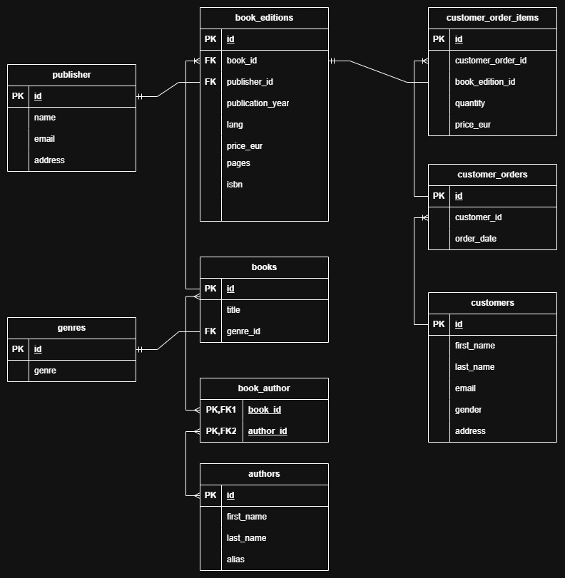

# BookStore Database
BookStore database models a simple business scenario for a small, online bookstore.

## Project Scope

This project focuses on backend data validation for a relational bookstore database.
The goal is to identify data integrity issues, business logic violations, and relational inconsistencies using SQL queries.

## Requirements
Before cloning the repository, make sure that the necessary tools are installed.

|Tool|Version|
|--|--|
|PostgreSQL|18.2|
|Python|3.14.3|

Python packages:
* psycopg2

## How to run?
1. Clone the repository `https://github.com/FrancoCaredda/BookStoreDB.git`  
2. Open the cloned folder in a terminal  
3. Run `python build.py <username> <password>` 
4. Run `python import_all_tables.py <username> <password>`
5. Once you see the success message in the terminal, the db is ready

## Test cases

|ID|Description|Precondition|Steps|Expected Results|Severity|
|--|--|--|--|--|--|
|BK-001|Verify that the prices of books are not negative or zero|Active connection to the database + imported data|1. Filter records in book edition for price being less than or equal to zero; 2. Observe the results|No rows are returned|High|
|BK-002|Verify that books have at least one author associated with them|Active connection to the database + imported data|1. Filter records in books for absence in the book_author conjunction table; 2. Observe the result|No rows are returned|Critical|
|BK-003|Verify that orders have at least one order item associated with them|Active connection to the database + imported data|1. Filter records in customer_orders for absence in customer_order_items; 2. Observe the results|No rows are returned|High|
|BK-004|Verify that there are no order items with the quantity less than or equal to zero|Active connection to the database + imported data|1. Select order items with the quantity less than or equal to zero; 2. Observe the results|No rows are returned|High|
|BK-005|Verify that there are no orders made in the future|Active connection to the database + imported data|1. Select orders with the order date greater than today; 2. Observe the results|No rows are returned|Medium|
|BK-006|Verify that there are no repeated emails in the customers table|Active connection to the database + imported data|1. Group records in the customers table by email; 2. Filter for COUNT(*) > 1; 3. Observe the results|No rows are returned|Critical|
|BK-007|Verify that there are no repeated order items with the same book_edition in one order|Active connection to the database + imported data|1. Group records in the customer_order_item by book_edition_id and customer_order_id; 2. Filter for COUNT(*) > 1; 3. Observe the results|No rows are returned|Critical|
|BK-008|Verify that every author's first name, last name, and alias are not NULL simultaneously|Active connection to the database + imported data|1. Select the id, first name, last name, and alias from authors; 2. Filter the values for NULLs for all three columns (first_name, last_name, alias); 3. Observe the results|No rows are returned|High|
|BK-009|Verify that the first names of authors are filled if the last names are not null|Active connection to the database + imported data|1. Select the id, first name, and last name from authors; 2. Filter the records for the first name being NULL and the last name not being NULL; 3. Observe the results|No rows are returned|High|
|BK-010|Verify that publishers' emails are not duplicated|Active connection to the database + imported data|1. Group records in publishers by email; 2. Filter for COUNT(*) > 1; 3. Observe the results|No rows are returned|Critical|

## Bug reports

Bug reports written in Jira-style manner

**[DEV][DB][book_editions] The isbn column violates the UNIQUE constraint in book_editions.csv**  
*Steps to reproduce*
1. Run `python import_single_table.py book_editions bookstore <username> <password>`;
2. Observe the results.  

*Actual results*  
* pycopg2.errors.UniqueViolation: duplicate key value violates unique constraint "book_editions_isbn_key"

*Expected results*  
* The dataset shoudn't contain any duplicates of ISBN, and the import should be successful.  

*Additional Information*
* Severity: Critical

---

**[DEV][DB][customer_order_items] customer_order_id FK violation: uuid doesn't exist in customer_order_item**  
*Steps to reproduce*
1. Run `python import_single_table.py customer_order_items.csv bookstore <username> <password>`;
2. Observe the results.  

*Actual results*  
* pycopg2.errors.ForeignKeyViolation: insert or update on table "customer_order_items" violates foreign key constraint "customer_order_items_customer_order_id_fkey"

*Expected results*  
* The dataset shoudn't contain keys that violate foreign key constraint, and the import should be successful.  

*Additional Information*
* Severity: Critical

---

**[DEV][DB][customer_orders] Orders with no items are in the table customer_orders**  
*Steps to reproduce*
1. Connect to the `bookstore` database;
2. Execute the following validation query to identify empty orders;
```SQL
SELECT co.id
FROM customer_orders AS co
WHERE NOT EXISTS (
    SELECT customer_order_id
    FROM customer_order_items
    WHERE customer_order_id = co.id
);
```
3. Observe the results.

*Actual results*  
* The query returns several records that don’t have items. See `tests/reports/BK-003.csv` to identify them. This is wrong, since an order without an item can’t be created.

*Expected results*  
* The query returns no records, and no empty order is present.  

*Additional Information*
* Severity: High

---

**[DEV][DB][customer_orders] Orders with order_date greater than the current date are present in the table**  
*Steps to reproduce*
1. Connect to the `bookstore` database;
2. Filter the customer_orders table for order_date > CURRENT_DATE;
```SQL
SELECT id, order_date
FROM customer_orders
WHERE order_date > CURRENT_DATE;
```
3. Observe the results.

*Actual results*  
* Orders with order_date > CURRENT_DATE are returned from the query. See `tests/reports/BK-005.csv` to identify them.

*Expected results*  
* The query returns no records, and no order in the future is present.  

*Additional Information*
* Severity: Medium

## Schema


## SQL Techniques
* JOINs
* Aggregate functions
* GROUP BY + HAVING
* Subqueries
* NOT EXISTS